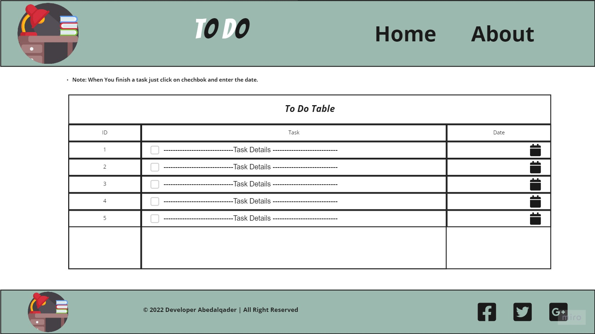
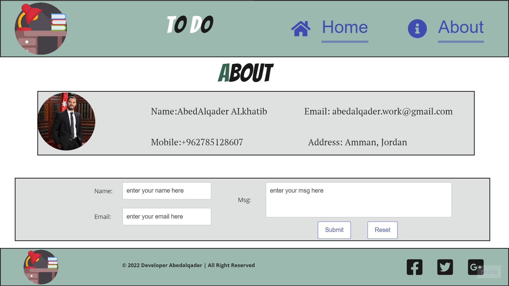

# todo-project

---

Title: "Task3 + Task4 + Task5"+"Task6"

Author: "Abedalqader Alkhatib"

Date: "1/18/2022 - 1/19/2022 - 1/20/2022- 1/23/2022"

---

## The wireframe

 I create a wireframe for To-Do website using Miro.

* The Home Wireframe.

* The About  Wireframe.

 > The Last Edit at 1/20/2022 add js file inside scripts folder also connected witht the html file.
>Add Three Question Yes/No.